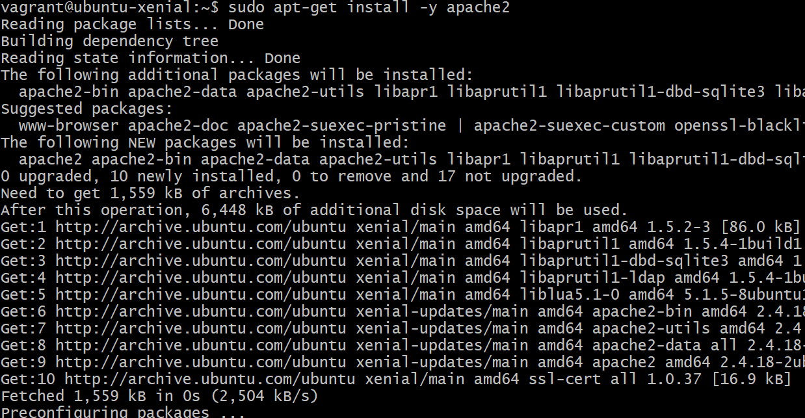
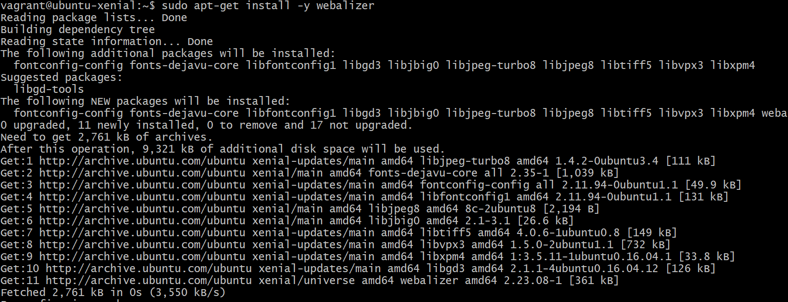
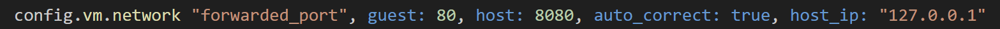
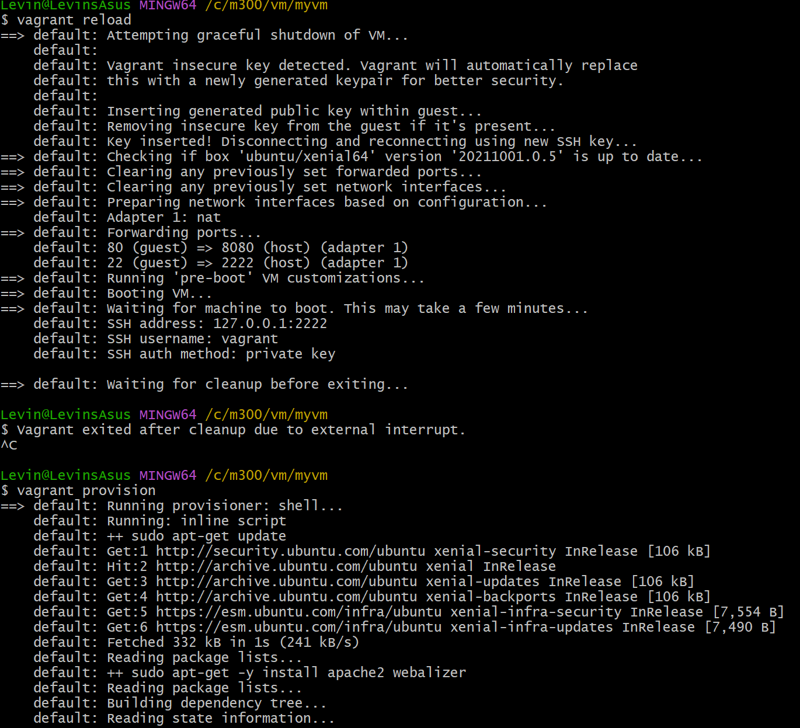
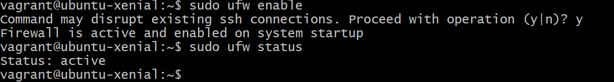
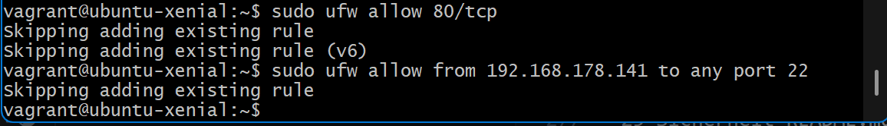
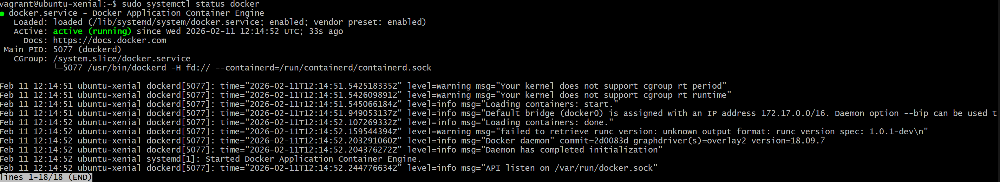
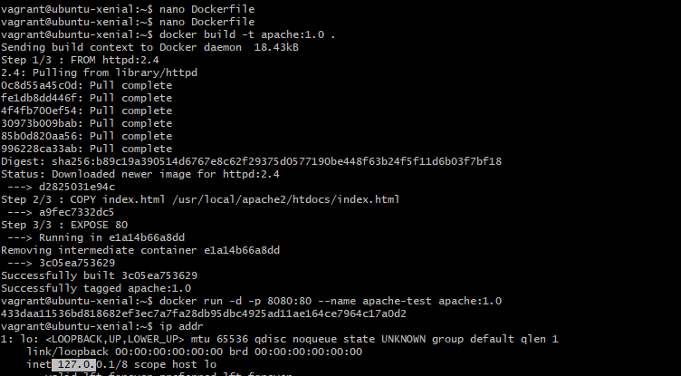
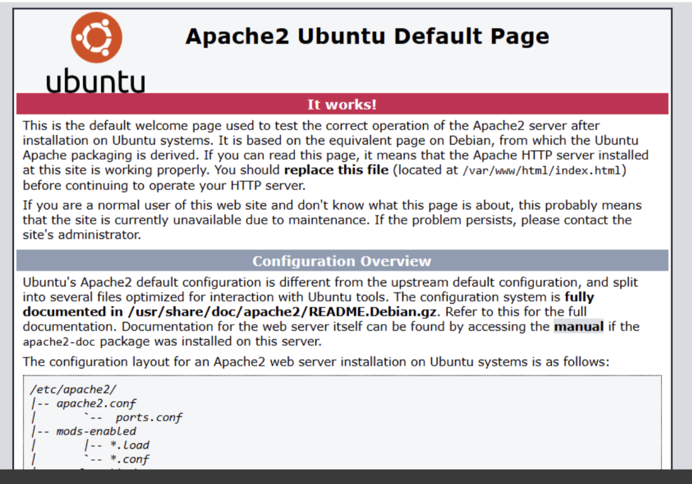

# 10-Toolumgebung

## Git und Github

```bash
git clone <>
git pull
git add -A
git commit -m ""
git push
```
- Versionsverwaltung und zentrales Repository
- Authetifizierung über SSH-Keys

---

## Virtualbox


- Lokaler HyperVisor
- Basis für Vagrant

---

## Vagrant

```bash
vagrant init ubuntu/xenial64
vagrant up --provider virtualbox
vagrant ssh
vagrant destroy -f
```
- Automatisierte VM erstellung

---

## Apache

```bash
sudo apt update
sudo apt install apache2 -y
```
- Webserver auf ubuntu

---


---

## VsCode

```bash
"files.exclude": {
"**/.git": true,
"**/.svn": true,
"**/.hg": true,
"**/.vagrant": true,
"**/.DS_Store": true}
```
- Git Integration
- Verhindert das hochladen von VM bezogen Dateien


# 20-Infrastruktur Fragen.md

## Fragen Cloud-Computing  
### 1. Was versteht man unter Cloud Computing?
- Software die nicht auf deinem Lokalen rechner installiert sind, sondern auf einem Rechner den man über das internet ereicht.

### 2. Was versteht man unter Infrastructure as a Service - IaaS
- IaaS ist die unterste schicht im Cloudcomputing, Der Benutzer verwaltete virtuelle Maschinen grösteteils selber.

---

## Fragen Infratsructure as Code
### 3. Was ist der Unterschied zur manuellen Installation der VM
- Es geht viel schneller, ist einfacher zu Dokumentieren (Commands). 

---

## Fragen zu Vagrant
### 4. Was wird mit Vagrant erzeugt?
- Virtuelle Maschinen, z.B in Oracle virtual Box, AWS.

### 5. Welche Aussagen Treffen zu?
- B:Vagrant erzeugt virtuelle Maschinen 
### 6. In welchen Bereich des Cloud-Computings ist Vagrant einzuordnen: IaaS, PaaS, SaaS?
- In IaaS, es ist die unterste schicht.
  
### 7. Welche Alternativen zu Vagrant bestehen?
- z.B Lima und Packer. 

### 8. Wo Speichert Vagrant seine Konfiguration?
- Im Vagrantfile. 

### 9. Was bedeutet die Fehlermeldung "A Vagrant environment or target machine is required to run this command."?
- Die Maschine ist in einem Verzeichnis, wo kein Vagrantfile exisitert. 

### 10. Bei welcher LPI Zertifizierung nützt mir das Vagrant Wissen?
- Für diverse Zertifikate in richtung Linux DEV.
  
---

# 20-Infrastruktur README.md

## Arten von Cloudcomputing
- **IaaS** (Infrastructure as a Service), Stellt die grundlegende IT-Infrastruktur wie Virtuelle Maschinen, Netzwerke und Speicher bereit, der Benutzer verwaltet selber (AWS).

- **CaaS** (Container as a Service), ermäglicht das Betreiben von Container, der Benutzer muss sich nicht um Hardware kümmern (Docker).
- **PaaS** (Platform as a Service), stellt komplette Umgebungen bereit, der Benutzer hat keine Kontrolle über Server oder Betriebsystem (Google App Engine).
- **SaaS** (Software as a Service), stellt die komplette Software bereit, der Benutzer muss sich nicht über Wartung oder Installation kümmern (Gmail). 

---

## Dynamic Infrastructure Platforms

- Virtualisierte Infrastrukturen die Seicher, Netzwerk und CPU bereitstellen.
- Ressourcen werden dynamische verwaltet.
- Bereitstellung läuft über Virtuelle Maschinen.
- Nutzung ist Lokal und Cloudbasiert möglich.
- Beispiel, Microsoft Azure.

### Formen von Dynamic Infrastructure Platforms
#### Public Cloud, externe Anbieter stellen die Infrastruktur bereit. 
- AWS
- Microsoft Azure
- Google Cloud

#### Private Cloud, externe Anbieter stellen die dedezierten Ressourcen bereit. 
- Cloudstack
- Openstack
- VMware vCloud
  
#### Lokale Virtualisierung, die Virtualisierung verwendet Ressourcen von dem Lokalen Rechner.
- Oracle Virtualbox
- Hyper V
- VMware Player
- Hyperkonvergente Systeme, vereinigt CPU, Storage und Netzwerk in einer Hardwarelösung. 

---

## Voraussetzungen für Infrastructure as Code

### Programmierbarkeit
- Zugriff auf Ressourcen über API's notwendig.

### On-demand
- Ressourcen müssen schnell verfügbar sein.

### Self-Service
- Benutzer können Ressourcen selbst verwalten.

### Portabilität
- Plattformen sollen schnell austauschbar sein.

### Sicherheit
- Unterstützung von Sicherheitsstandards und Zertifikaten.

---     

## Infrastructure as Code
- It-Infrastruktur wird Virtualisiert.
- Bereitstellung und Konfiguration wird automatisiert.
- Einsatzt bewährt DevOps-Methoden
- Versionsverwaltung
- Continous Integration
- Continous Delivery
- Testautomatisierungen

### Technische Ziele von IaC
- Schnelle Änderungen am System
- Wiederholbare Deployments
- Schnelle Wiederherstellung
- Automatisierung vom manuellen Prozessen

### Zentrale Tools
- Infrastructure Provisioning
- Openstack
- CloudFormation
  
#### Configuration und Images
- Vagrant
- Docker
  
#### Scripting
- Bash
- Powershell

#### Repositories
- Github

---

# Vagrant

---

## Zentrale Befehle

```bash
vagrant init, Initialisiert Vagrantfile
vagrant up, Erstellt und startet VM
vagrant ssh, SSH-Zugriff auf VM
vagrant status, Status der VM anzeigen
vagrant port, Weitergeleitete Ports anzeigen
vagrant halt, VM stoppen
vagrant destroy -f, VM löschen
```

---

## Konfiguration (Vagrantfile)

```bash
Vagrant.configure("2") do |config|
config.vm.box = "bento/ubuntu-16.04"
config.vm.hostname = "srv-web"
config.vm.network :forwarded_port, guest: 80, host: 4567
end
```

---

## Provisioning
- Automatisierte Konfiguration der VM
-  Über Shell, Bash

```bash
config.vm.provision :shell, inline: <<-SHELL
sudo apt-get update
sudo apt-get -y install apache2
SHELL
```

---

## Provider
- Definiert die Plattformen
  
```bash
config.vm.provider "virtualbox" do |vb|
vb.memory = "512"
end
```

---

## Workflow
- WM erstellen

```bash
mkdir myserver
cd myserver
vagrant init ubuntu/xenial64
vagrant up
```

- VM aktualisieren

```bash
vagrant provision
# oder
vagrant destroy -f
vagrant up
```

- VM löschen

```bash
vagrant destroy -f
```        

---

## Synced Folders
- Gemeinsamer Ordner zwischen Host und VM

```bash
config.vm.synced_folder ".", "/var/www/html"
```

---

## Reflexion

### Cloud Computing
- Ausführung von Anwendungen auf entfernten, netzwerkbasierten Systemen.
- Systeme sind nicht an Lokale hardware gebunden.
- Dynamic Infrastructure Platforms stellen Netzwerk, Speicher und CPU bereit.
- Ressourcen werden automatisch verwaltet.
- Bereitstellung über Virtuelle Maschinen.

### Vorrausetzung für Infrastrucutre as Code
- Zugriff auf Ressourcen über API's notwendig.
- Ressourcen müssen schnell verfügbar sein.
- Benutzer können Ressourcen selbst verwalten.
- Plattformen sollen schnell austauschbar sein.
- Unterstützung von Sicherheitsstandards und Zertifikaten.

---

# 20 LB2.md

## Neue VM Erstellen

- Im Git-Bash mit folgenden Befehlen das neue Verzeichnis erstellen und dahin wechseln.

```bash
cd myM300/
mkdir myVM
cd myVM
```


- Im Git-Bash mit folgenden Befehlen die VM erstellen und starten.

```bash
vagrant init ubuntu/xenial64
vagrant up
```


- Mit dem Befehl kann man sich über Git-Bash mit der VM verbinden.

```bash
vagrant up
```


---

## Serverdienste auswählen

- Bevor man den Apache Server und den Webalizer installieren kann, sollte man die VM updaten.

```bash
sudo apt-get update
```

- Danach apache2 installieren.

```bash
sudo apt install apache2 -y
```


- Anschliessend den Webalizer per befehl installieren

```bash
sudo apt-get install -y webalizer
```


- Mit dem befehl "History" erscheinen alle zuvor eineggeben commands.


---

## Feintuning
- Per befehl testen, welche ports von der VM weitergeleitet werden.
  
```bash
vagrant port
```

- Man sieht das aktuell nur der SSH-Port (22) weitergeleitet wird, es fehlt noch Port 80 für Apache-Server.
- Um die Portweiterleitung auf Port 80 zu erstellen, muss man das Vagrantfile bearbeiten, dass kan man per folgendem befehl öffnen.

```bash
code Vagrantfile
```

- Danach die VM mit folgenden Commands neustarten und neu laden.

```bash
vagrant reload
vagrant provision
```


- Testen ob Port 80 nun weitergeleitet wird.

```bash
Vagrant Port
```


- Website aufrufen über "http://localhost:8080/webalizer"


---

# 25-Sicherheit Fragen.md

## Firewall und Reverse Proxy

### Was ist der Unterschied zwischen einem Web Server und einen Reverse Proxy?
- Ein Web-Server hat direkt HTML-Seiten, ein Reverse-Proxy dient als stellvertreter.

### Was verstehen wir unter einer "White List"?
- Die Liste an Vertrauenswürdigen Objekten, z.B Server

### Was wäre die Alternative zum Absichern der einzelnen Server mit einer Firewall?
- Eine zentrale Firewall für das ganze Netz.

## SSH

### Was ist der Unterschied zwischen der id_rsa und id_rsa.pub Datei?
- Private und Public Key

### Wo darf ein SSH Tunnel nicht angewendet werden?
- Im geschäftlichen Bereich

### Für was dient die Datei authorized_keys?
- Beinhaltet die Keys von allen die sich ohne passwort anmelden dürfen.

### Für was dient die Datei known_hosts?
- Listet alle Hosts auf, wo ich schnonmal angemeldet war.

---

# 25-Sicherheit README.md

## UFW Firewall Installation

- Mit folgendem Command die Firewall installieren

```bash
sudo apt-get install ufw
```

- UFW starten mit folgenden Befehlen

```bash
sudo ufw enable
```

- Status überprüfen mit

```bash
sudo ufw status
```



---

## Firewall-Regeln

### Firewallregeln für folgende Ports aktivieren.
- sudo ufw allow 80/tcp
- sudo ufw allow ssh


---

## Reverse Proxy

- Folgende Commands ausführen

```bash
sudo apt-get install libapache2-mod-proxy-html
sudo apt-get install libxml2-dev
```

- Apache Module installieren

```bash
sudo a2enmod proxy
sudo a2enmod proxy_html
sudo a2enmod proxy_http 
```

- Danach den Apache Service neustarten

```bash
service apache2 restart
```

---

# 30-Container Fragen.md

## Container

### Was ist der Unterschied zwischen Vagrant und Docker?
- Vagrant ist für IaaS und Docker für PaaS

### Welches Tools aus dem Docker Universum ist Vergleichbar mit Vagrant?
- docker machine

### Was macht der Docker Provisioner von Vagrant?
-   Installiert Docker in einer Virtuellen Maschine

### Welche Linux Kernel Funktionalität verwenden Container?
- Linux Namespaces

### Welches Architekturmuster verwendet der Entwickler wenn er Container einsetzt?
- Microservices

### Welches sind die drei Hauptmerkmale (abgeleitet vom Ur-Unix) von Microservices?
- Ein Porgramm soll nur eine Aufgabe haben.
- Programme sollen zusammen arbeiten können.
- Sollen eine Universielle schnistelle haben.

---

## Docker

### Was ist der Unterschied zwischen einem Docker Image und einem Container?
-   Image = gebuildet, Container Image = aktuelle Änderungen im Filesystem

### Was ist der Unterschied zwischen einer Virtuellen Maschine und einem Docker Container?
- Docker ist nur der Prozess, z.B Web-Server, VM hat noch das OS.
  
### Wie bekomme ich Informationen zu einem laufenden Docker Container?
-Mit docker-logs, docker inspect

### Was ist der Unterschied zwischen einer Docker Registry und einem Repository
- Im Registry werden die Images gespeichert und im Repository die verschieden Versionen vom Image

### Wie erstelle ich ein Container Image
- docker build

### In welcher Datei steht welche Inhalte sich im Container Image befinden?
- Dockerfile

### Der erste Prozess im Container bekommt die Nummer?
- 1
  
### Welche Teile von Docker sind durch Kubernetes obsolet geworden, bzw. sollten nicht mehr verwendet werden?
- Swarm, Compose, Network und Volumes

### Welche Aussage ist besser

#### A: Dockerfile sollten möglichst das Builden (CI) und Ausführen von Services beinhalten, so ist alles an einem Ort und der Entwickler kann alles erledigen.

#### B: Das Builden und Ausführen von Services ist strikt zu trennen. Damit saubere und nachvollziehbare Services mittels CI/CD Prozess entstehen.
- Aussage B

---

## Docker Hub

### Was ist Docker Hub?
- Ein Container Registry, wo Images gespeichert werden

### Welches sind die Alternativen?
- Fast jeder Cloud-Anbieter stellt ein Container Registry zu verfügung

### Warum sollte eine eigene Docker Registry im Unternehmen verwendet werden?
- Sicherheit, alle Images sind zentral überewacht, gleiche Quelle

### Warum sollten Versionen tag von Images immer angegeben werden?
- Ansonsten wird immer nur das neuste verwendet, egal welche Version es hat. 

### Was ist der Unterschied zwischen docker save/docker load und docker export/docker import?
- save/load ist für Image, export/import für Container

---

# 30-Container README.md

## Container

### Grundlagen
- Isolation vom Hostsystem
- Nutzung des Host-Kernels (kein OS)
- Überall gleiche Laufumgebung

### Merkmale
- Gemeinsame Ressourcennutzung
- Schneller Start/Stop (flexibel)
- Geringer Ressourcenverbrauch
- Viele Container parallel möglich

### Microservices und Container
- Architektur aus kleinen, unabhängigen Services
- Kommunikation über das Netzwerk
- Ressourcen pro Service skalierbar

---

## Docker

### Grundlagen
- Basiert auf Linux-Containertechnologie
- Portable Images
- Vereinheitlicht erstellen, Verteilen und Ausführen

### Plattform-Komponente 

#### Docker-Engine
- Erstellt und startet Container
- Besteht aus Docker Daemon und API

#### Docker-HUB
- Zentrales Registry
- Speichern und Verteilen des Images

### Architektur

#### Docker-Daemon
- Erstellt, überwacht Container
- Speichert Images
- Läuft als Dienst auf Host
  
#### Docker-Client
- CLI-Steurung von Docker
- Kommunikation mit Daemon via HTTP-REST
- Ermöglicht Remote-Verbindung

### Images
- Unveränderliche Vorlage für Container
- Versioniert durch Tags
- Für änderungen, muss ein neues Image erstellt werden

### Container
- Instanz eines Images
- Mehrere Container pro Image möglich

### Docker Registry
- Speicherort für Images
- Docker HUB

---

## Zentrale Docker Befehle

### Container Starten

```bash
docker run web
docker run -it ubuntu /bin/bash
docker run -d ubuntu sleep 20
docker run -d --rm ubuntu sleep 20
```

### Container anzeigen

```bash
docker ps
docker ps -a
docker ps -a -q
```

### Images anzeigen

```bash
docker image
docker image ls
```

### Container löschen

```bash
docker rm web
docker rm $(docker ps -a -q)
docker rm -f $(docker ps -a -q)
```

### Image löschen

```bash
docker rmi ubuntu
docker rmi $(docker images -q -f dangling=true)
```

### Container Starten/Stoppen

```bash
docker start >id>
docker stop <id>
docker kill <id>
```

### Container-Informationen

```bash
docker logs <id>
docker inspect <id>
docker diff <id>
docker top <id>
```

---

## Dockerfile

### Grundlagen
- Textdatei mit Build-Anweisungen für Docker-Images
- Wird mit docker-build gemacht

### Image bauen und starten

```bash
docker build -t mysql .
docker run --rm -d --name mysql mysql
docker exec -it mysql bash
```

### Überprüfen im Container

```bash
ps -ef
netstat -tulpen
```

---

## Konzepte

### Build Context
- Verzeichnis mit Datein und Dockerfile
- Wird bei docker-build übergeben
- Dateien werden mit COPY oder ADD hinzugefügt

### Imageschichten
- Jede Anweisung vom Dockerfile erzeugt eine neue Schicht
- Layer sind unveränderlich
- Änderunge erzeugen ein neues Image

---

## Dockerfile-Anweisungen

### Basis
- FROM-Image definieren
- MAINTAINER-Autor setzten

### Datein und Verzeichnis
- ADD-Dateien ins Image kopieren
- COPY-Datein aus Image-Context kopieren
- WORKDIR-Arbeitsverzeichnis erstellen
- VOLUME-Ein Volume definieren

### Prozess
- RUN-Befehl ausführen
- CMD-Befehl bei Containerstart
- ENTRYPOINT-Prozess beu Containerstart
- SHELL-Shell definieren
- USER-Benutzer festlegen

### Netzwerk
- EXPOSE-Port deklarieren
- ENV-Variable setzen
- HEALTHCHECH-Status üerprüfen

---

## Image-Bereitstellung

### Grundlagen
- Eigene Images verteilen
#### Bereitstellung über
- Docker HUB
```bash
docker pull
docker load
```

### Namensgebung und Tags
- Format: Repository:tag
- Beispiel: Ubuntu:0.8.2
- Ohne tag=latest

### Image taggen

```bash
docker build -t mysql .
docker build -t mysql:1.0 .
docker tag mysql username/mysql
```

### Docker-HUB
- Offizielles Registry von Docker
- Öfentliches und Privates Repository möglich

#### Image hochladen

```bash
docker tag mysql username/mysql
docker push username/mysql
```

#### Image suchen und herunterladen

```bash
docker search mysql
docker pull ubuntu
```

---

## Export/Import ohne Registry

### Container exportieren

```bash
docker export containername -o container.tar
docker import container.tar neuesimage
```

### Images sichern und laden

```bash
docker save mysql -o mysql.tar
docker load -i mysql.tar
```

---

## Privates Registry

### Registry starten

```bash
sudo docker pull registry:2

sudo docker run -d -p 5000:5000 --restart=always \
  --name registry \
  -v /var/spool/docker-registry:/var/lib/registry \
  registry:2
```

### Docker-Client konfigurieren

#### Datei erstellen

```bash
/etc/docker/daemon.json
```

#### Inhalt

```bash
"insecure-registries":"SERVER:5000"
```

#### Docker neustarten

```bash
sudo systemctl restart docker
```

### Image auf privates Registry pushen

```bash
docker tag ubuntu SERVER:5000/myubuntu
docker push SERVER:5000/myubuntu
docker pull SERVER:5000/myubuntu
```

---

# 30-LB3

## Server erstellen

- Verzeichnis erstellen
```bash
cd M300/docker
vagrant init ubuntu/xenial64
vagrant up
vagrant ssh
docker run hello-world
```


- Docker file anpassen

```bash
code vagrantfile
```
- Inhalt ersetzten durch

```bash
Vagrant.configure(2) do |config|
  config.vm.box = "ubuntu/xenial64"
  config.vm.network "forwarded_port", guest:80, host:8080, auto_correct: true
  config.vm.synced_folder ".", "/var/www/html"  
config.vm.provider "virtualbox" do |vb|
  vb.memory = "512"  
end
config.vm.provision "shell", inline: <<-SHELL
  sudo apt-get update
  sudo apt-get -y install apache2 
SHELL
end
```
- Per SSH verbinden

```bash
vagrant ssh
```

---

## Docker installieren

- Updates und Docker installieren

```bash
sudo apt-get update
sudo apt-get -y install docker.io
sudo systemctl enable --now docker
```
- Dokcer Status überprüfen

```bash
sudo systemctl status docker
```


---

## Dockerfile erstellen

- Auf dem Vagrant Server das Dockerfile erstellen

```bash
nano Dockerfile
```

- Folgenden inhalt einfügen

```bash
FROM ubuntu:14.04
RUN apt-get update
RUN apt-get -q -y install apache2 
# Konfiguration Apache
ENV APACHE_RUN_USER www-data
ENV APACHE_RUN_GROUP www-data
ENV APACHE_LOG_DIR /var/log/apache2
RUN mkdir -p /var/lock/apache2 /var/run/apache2
EXPOSE 80
VOLUME /var/www/html
CMD /bin/bash -c "source /etc/apache2/envvars && exec /usr/sbin/apache2 -DFOREGROUND"
```

### Image bauen

```bash
docker build -t my-apache .
```

### Container starten

```bash
docker run -d --name apache1 -p 80:80 my-apache
```



### Zugriff Testen
#### Im Browser "http://localhost:8080"


### Probleme

#### Dockerfile lokal auf dem Host erstellt
- Das kann funktionieren, bei mit konnte die VM das File nie finden, deshalb habe ich es auf der VM erstellt um das Problem zu lösen

---

# 35-Sicherheit Fragen.md

## Protokollieren und Überwachen

### Warum sollten Container überwacht werden?
- Um fehlerhafte Container oder Container mit grosser Belastung frühzeitig zu erkennen.

### Was ist das syslog und wo ist es zu finden?
- Die Systemlogs eines Linux-Hosts.

### Was ist stdout, stderr, stdin?
- Standard Output, Standard Error Output und standard Inpout Eingabe

## Container sichern und beschränken

### Wie kann docker run -v /:/homeroot -it ubuntu bash durch Normale User verhindert werden?
- Nur der root-Benutzer darf Container starten

### Wie können verschiedene Mandanten getrennt werden?
- Mit mehreren Virtuellen Maschinen

### Wie kann der Ressourcenverbrauch von Containern eingeschränkt werden?
- Docker nutzt den Linux Completely Fair Scheduler (CFS)
- Steuert und begrenzt CPU-Nutzung von Containern

#### Konzept

##### cpu-period
- Standard 100 ms
- Zeitfenster für CPU-Zuteilung

##### cpu-quota
- Maximale CPU-Zeit in einer Periode
