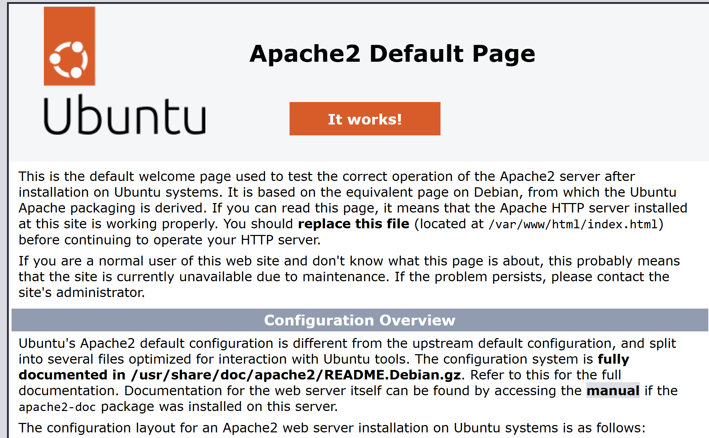
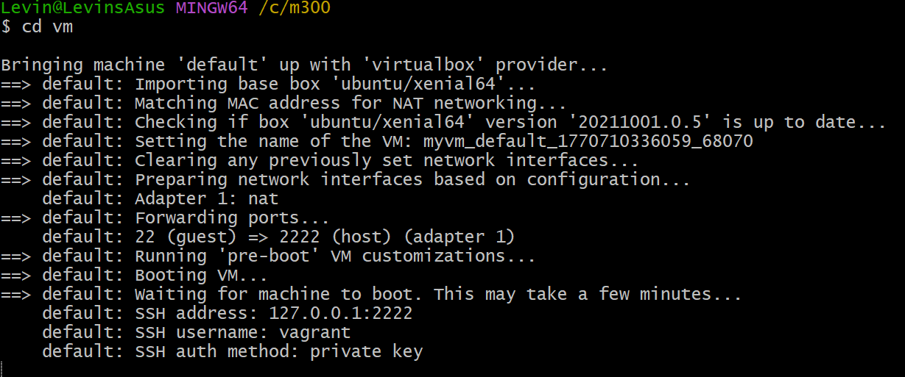
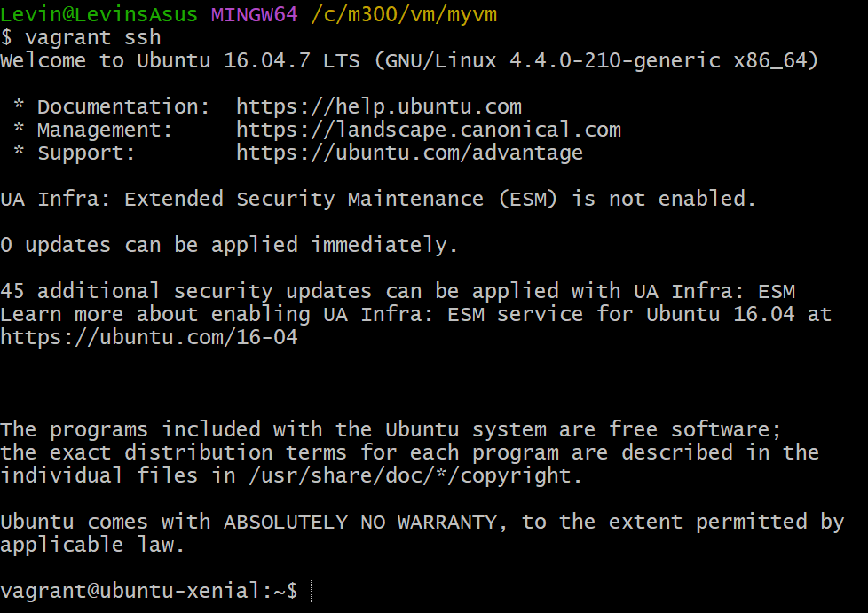
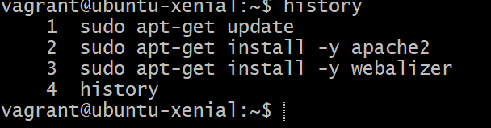

10-Toolumgebung

    Git und Github
            -git clone <>
            -git pull
            -git add -A
            -git commit -m ""
            -git push
        -Versionsverwaltung und zentrales Repository
        -Authetifizierung über SSH-Keys
    
    Virtualbox
        -Lokaler HyperVisor
        -Basis für Vagrant

    Vagrant
            -vagrant init ubuntu/xenial64
            -vagrant up --provider virtualbox
            -vagrant ssh
            -vagrant destroy -f
        -Automatisierte VM erstellung
    
    Apache
            -sudo apt update
            -sudo apt install apache2 -y
        -Webserver auf ubuntu

    
    VsCode
            -"files.exclude": {
            -"**/.git": true,
            -"**/.svn": true,
            -"**/.hg": true,
            -"**/.vagrant": true,
            -"**/.DS_Store": true}
        -Git Integration
        -Verhindert das hochladen von VM bezogen Dateien

20-Infrastruktur Fragen.md

    Fragen Cloud-Computing  
        1. Was versteht man unter Cloud Computing?
            -Software die nicht auf deinem Lokalen rechner installiert sind, sondern auf einem Rechner den man über das internet ereicht.
        2. Was versteht man unter Infrastructure as a Service - IaaS?
            -IaaS ist die unterste schicht im Cloudcomputing, Der Benutzer verwaltete virtuelle Maschinen grösteteils selber.
    
    Fragen Infratsructure as Code
        1. Was ist der Unterschied zur manuellen Installation der VM
            -Es geht viel schneller, ist einfacher zu Dokumentieren (Commands). 
    
    Fragen zu Vagrant
        1. Was wird mit Vagrant erzeugt?
            -Virtuelle Maschinen, z.B in Oracle virtual Box, AWS.
        2. Welche Aussagen Treffen zu?
            a: Vagrant ist ein HyperVisor
            b: Vagrant erzeugt virtuelle Maschinen, dabei werden mehrere HyperVisor und Cloud Umgebungen (z.B. AWS) unterstützt.
            c: Vagrant erzeugt Container
                -B ist korrekt. 
        3. In welchen Bereich des Cloud-Computings ist Vagrant einzuordnen: IaaS, PaaS, SaaS?
            -In IaaS, es ist die unterste schicht. 
        4. Welche Alternativen zu Vagrant bestehen?
            -z.B Lima und Packer. 
        5. Wo Speichert Vagrant seine Konfiguration?
            -Im Vagrantfile. 
        6. Was bedeutet die Fehlermeldung "A Vagrant environment or target machine is required to run this command."?
            -Die Maschine ist in einem Verzeichnis, wo kein Vagrantfile exisitert. 
        7. Bei welcher LPI Zertifizierung nützt mir das Vagrant Wissen?
            -Für diverse Zertifikate in richtung Linux DEV.

20-Infrastruktur REDME.md

    Arten von Cloudcomputing
        -IaaS (Infrastructure as a Service), Stellt die grundlegende IT-Infrastruktur wie Virtuelle Maschinen, Netzwerke und Speicher bereit, der Benutzer verwaltet selber (AWS).
        -CaaS (Container as a Service), ermäglicht das Betreiben von Container, der Benutzer muss sich nicht um Hardware kümmern (Docker).
        -PaaS (Platform as a Service), stellt komplette Umgebungen bereit, der Benutzer hat keine Kontrolle über Server oder Betriebsystem (Google App Engine).
        -SaaS (Software as a Service), stellt die komplette Software bereit, der Benutzer muss sich nicht über Wartung oder Installation kümmern (Gmail). 
    
    Dynamic Infrastructure Platforms
        -Virtualisierte Infrastrukturen die Seicher, Netzwerk und CPU bereitstellen.
        -Ressourcen werden dynamische verwaltet.
        -Bereitstellung läuft über Virtuelle Maschinen.
        -Nutzung ist Lokal und Cloudbasiert möglich.
        -Beispiel, Microsoft Azure.

    Formen von Dynamic Infrastructure Platforms
        -Public Cloud, externe Anbieter stellen die Infrastruktur bereit. 
            -AWS
            -Microsoft Azure
            - Google Cloud
        -Private Cloud, externe Anbieter stellen die dedezierten Ressourcen bereit. 
            -Cloudstack
            -Openstack
            -VMware vCloud
        -Lokale Virtualisierung, die Virtualisierung verwendet Ressourcen von dem Lokalen Rechner.
            -Oracle Virtualbox
            -Hyper V
            -VMware Player
        -Hyperkonvergente Systeme, vereinigt CPU, Storage und Netzwerk in einer Hardwarelösung. 

    Voraussetzungen für Infrastructure as Code
        -Programmierbarkeit
            -Zugriff auf Ressourcen über API's notwendig.
        -On-demand
            -Ressourcen müssen schnell verfügbar sein.
        -Self-Service
            -Benutzer können Ressourcen selbst verwalten.
        -Portabilität
            -Plattformen sollen schnell austauschbar sein.
        -Sicherheit
            -Unterstützung von Sicherheitsstandards und Zertifikaten.
        
    Infrastructure as Code
        -It-Infrastruktur wird Virtualisiert.
        -Bereitstellung und Konfiguration wird automatisiert.
        -Einsatzt bewährt DevOps-Methoden
            -Versionsverwaltung
            -Continous Integration
            -Continous Delivery
            -Testautomatisierungen
        -Technische Ziele von IaC
           -Schnelle Änderungen am System
           -Wiederholbare Deployments
           -Schnelle Wiederherstellung
           -Automatisierung vom manuellen Prozessen
        -Zentrale Tools
            -Infrastructure Provisioning
                -Openstack
                -CloudFormation
            -Configuration und Images
                -Vagrant
                -Docker
            -Scripting
                -Bash
                -Powershell
            -Repositories
                -Github

    Vagrant
        -Zentrale Befehle
                -vagrant init, Initialisiert Vagrantfile
                -vagrant up, Erstellt und startet VM
                -vagrant ssh, SSH-Zugriff auf VM
                -vagrant status, Status der VM anzeigen
                -vagrant port, Weitergeleitete Ports anzeigen
                -vagrant halt, VM stoppen
                -vagrant destroy -f, VM löschen

        -Konfiguration (Vagrantfile)
                -Vagrant.configure("2") do |config|
                -config.vm.box = "bento/ubuntu-16.04"
                -config.vm.hostname = "srv-web"
                -config.vm.network :forwarded_port, guest: 80, host: 4567
                -end

        -Provisioning
            -Automatisierte Konfiguration der VM
            -Über Shell, Bash
                -config.vm.provision :shell, inline: <<-SHELL
                -sudo apt-get update
                -sudo apt-get -y install apache2
                -SHELL

        -Provider
            -Definiert die Plattformen
                -config.vm.provider "virtualbox" do |vb|
                -vb.memory = "512"
                -end

        -Workflow
            -WM erstellen
                -mkdir myserver
                -cd myserver
                -vagrant init ubuntu/xenial64
                -vagrant up
            -WM aktualisieren
                -vagrant provision
                -# oder
                -vagrant destroy -f
                -vagrant up
            -VM löschen
                -vagrant destroy -f
        
        -Synced Folders
            -Gemeinsamer Ordner zwischen Host und VM
                -config.vm.synced_folder ".", "/var/www/html"
        
    Reflexion
        -Cloud Computing
            -Ausführung von Anwendungen auf entfernten, netzwerkbasierten Systemen.
            -Systeme sind nicht an Lokale hardware gebunden.
            -Dynamic Infrastructure Platforms stellen Netzwerk, Speicher und CPU bereit.
            -Ressourcen werden automatisch verwaltet.
            -Bereitstellung über Virtuelle Maschinen.

        -Vorrausetzung für Infrastrucutre as Code
            -Zugriff auf Ressourcen über API's notwendig.
            -Ressourcen müssen schnell verfügbar sein.
            -Benutzer können Ressourcen selbst verwalten.
            -Plattformen sollen schnell austauschbar sein.
            -Unterstützung von Sicherheitsstandards und Zertifikaten.

20 LB2.md

    -Neue VM Erstellen
        -Im Git-Bash mit folgenden Befehlen das neue Verzeichnis erstellen und dahin wechseln.
            -cd myM300/
            -mkdir myVM
            -cd myVM

        -Im Git-Bash mit folgenden Befehlen die VM erstellen und starten.
            -vagrant init ubuntu/xenial64
            -vagrant up

        -Mit dem Befehl "vagrant ssh" kann man sich über Git-Bash mit der VM verbinden.

    -Serverdienste auswählen
        -Bevor man den Apache Server und den Webalizer installieren kann, sollte man die VM updaten dazu "sudo     apt-get update"
        -Danach mit dem Befehl "sudo apt-get install -y apache2" apache2 installieren.

        -Anschliessend den Webalizer per befehl installieren
            -sudo apt-get install -y webalizer

        -Mit dem befehl "History" erscheinen alle zuvor eineggeben commands.

