# Dokuemntation M300 Levin Kellenberger

# Inhaltsverzeichnis
- [10 Toolumgebung](#10-tooleumgebung)
- [20 Infrastruktur](#20-infrastruktur)
  - [20 Infrastruktur Fragen](#20-infrastruktur-fragenmd)
  - [20 Infrastruktur README](#20-infrastruktur-readmemd)
  - [20 LB2](#20-lb2md)
- [25 Sicherheit](#25-sicherheit)
  - [25 Sicherheit Fragen](#25-sicherheit-fragenmd)
  - [25 Sicherheit README](#25-sicherheit-readmemd)
- [30 Container](#30-container)
  - [30 Container Fragen](#30-container-fragenmd)
  - [30 Container README](#30-container-readmemd)
  - [30 LB3](#30-lb3md)
- [35 Sicherheit](#35-sicherheit)
  - [35 Sicherheit Fragen](#35-sicherheit-fragenmd)
  - [35 Sicherheit README](#35-sicherheit-readmemd)
- [40 Kubernetes](#40-kubernetes)
  - [40 Kubernetes Fragen](#40-kubernetes-fragenmd)
  - [40 Kubernetes README](#40-kubernetes-readmemd)
- [50 Minecraft Server mit Dashboard](#50-minecraft-server-mit-dashboard)

# 10-Toolumgebung

## Git und Github

```bash
git clone <>
git pull
git add -A
git commit -m ""
git push
```
- Versionsverwaltung und zentrales Repository
- Authetifizierung über SSH-Keys

---

## Virtualbox


- Lokaler HyperVisor
- Basis für Vagrant

---

## Vagrant

```bash
vagrant init ubuntu/xenial64
vagrant up --provider virtualbox
vagrant ssh
vagrant destroy -f
```
- Automatisierte VM erstellung

---

## Apache

```bash
sudo apt update
sudo apt install apache2 -y
```
- Webserver auf ubuntu

---


---

## VsCode

```bash
"files.exclude": {
"**/.git": true,
"**/.svn": true,
"**/.hg": true,
"**/.vagrant": true,
"**/.DS_Store": true}
```
- Git Integration
- Verhindert das hochladen von VM bezogen Dateien

---

# 20-Infrastruktur
# 20-Infrastruktur Fragen.md

## Fragen Cloud-Computing  
### 1. Was versteht man unter Cloud Computing?
- Software die nicht auf deinem Lokalen rechner installiert sind, sondern auf einem Rechner den man über das internet ereicht.

### 2. Was versteht man unter Infrastructure as a Service - IaaS
- IaaS ist die unterste schicht im Cloudcomputing, Der Benutzer verwaltete virtuelle Maschinen grösteteils selber.

---

## Fragen Infratsructure as Code
### 3. Was ist der Unterschied zur manuellen Installation der VM
- Es geht viel schneller, ist einfacher zu Dokumentieren (Commands). 

---

## Fragen zu Vagrant
### 4. Was wird mit Vagrant erzeugt?
- Virtuelle Maschinen, z.B in Oracle virtual Box, AWS.

### 5. Welche Aussagen Treffen zu?
- B:Vagrant erzeugt virtuelle Maschinen 
### 6. In welchen Bereich des Cloud-Computings ist Vagrant einzuordnen: IaaS, PaaS, SaaS?
- In IaaS, es ist die unterste schicht.
  
### 7. Welche Alternativen zu Vagrant bestehen?
- z.B Lima und Packer. 

### 8. Wo Speichert Vagrant seine Konfiguration?
- Im Vagrantfile. 

### 9. Was bedeutet die Fehlermeldung "A Vagrant environment or target machine is required to run this command."?
- Die Maschine ist in einem Verzeichnis, wo kein Vagrantfile exisitert. 

### 10. Bei welcher LPI Zertifizierung nützt mir das Vagrant Wissen?
- Für diverse Zertifikate in richtung Linux DEV.
  
---

# 20-Infrastruktur README.md

## Arten von Cloudcomputing
- **IaaS** (Infrastructure as a Service), Stellt die grundlegende IT-Infrastruktur wie Virtuelle Maschinen, Netzwerke und Speicher bereit, der Benutzer verwaltet selber (AWS).

- **CaaS** (Container as a Service), ermäglicht das Betreiben von Container, der Benutzer muss sich nicht um Hardware kümmern (Docker).
- **PaaS** (Platform as a Service), stellt komplette Umgebungen bereit, der Benutzer hat keine Kontrolle über Server oder Betriebsystem (Google App Engine).
- **SaaS** (Software as a Service), stellt die komplette Software bereit, der Benutzer muss sich nicht über Wartung oder Installation kümmern (Gmail). 

---

## Dynamic Infrastructure Platforms

- Virtualisierte Infrastrukturen die Seicher, Netzwerk und CPU bereitstellen.
- Ressourcen werden dynamische verwaltet.
- Bereitstellung läuft über Virtuelle Maschinen.
- Nutzung ist Lokal und Cloudbasiert möglich.
- Beispiel, Microsoft Azure.

### Formen von Dynamic Infrastructure Platforms
#### Public Cloud, externe Anbieter stellen die Infrastruktur bereit. 
- AWS
- Microsoft Azure
- Google Cloud

#### Private Cloud, externe Anbieter stellen die dedezierten Ressourcen bereit. 
- Cloudstack
- Openstack
- VMware vCloud
  
#### Lokale Virtualisierung, die Virtualisierung verwendet Ressourcen von dem Lokalen Rechner.
- Oracle Virtualbox
- Hyper V
- VMware Player
- Hyperkonvergente Systeme, vereinigt CPU, Storage und Netzwerk in einer Hardwarelösung. 

---

## Voraussetzungen für Infrastructure as Code

### Programmierbarkeit
- Zugriff auf Ressourcen über API's notwendig.

### On-demand
- Ressourcen müssen schnell verfügbar sein.

### Self-Service
- Benutzer können Ressourcen selbst verwalten.

### Portabilität
- Plattformen sollen schnell austauschbar sein.

### Sicherheit
- Unterstützung von Sicherheitsstandards und Zertifikaten.

---     

## Infrastructure as Code
- It-Infrastruktur wird Virtualisiert.
- Bereitstellung und Konfiguration wird automatisiert.
- Einsatzt bewährt DevOps-Methoden
- Versionsverwaltung
- Continous Integration
- Continous Delivery
- Testautomatisierungen

### Technische Ziele von IaC
- Schnelle Änderungen am System
- Wiederholbare Deployments
- Schnelle Wiederherstellung
- Automatisierung vom manuellen Prozessen

### Zentrale Tools
- Infrastructure Provisioning
- Openstack
- CloudFormation
  
#### Configuration und Images
- Vagrant
- Docker
  
#### Scripting
- Bash
- Powershell

#### Repositories
- Github

---

## Vagrant

---

### Zentrale Befehle

```bash
vagrant init, Initialisiert Vagrantfile
vagrant up, Erstellt und startet VM
vagrant ssh, SSH-Zugriff auf VM
vagrant status, Status der VM anzeigen
vagrant port, Weitergeleitete Ports anzeigen
vagrant halt, VM stoppen
vagrant destroy -f, VM löschen
```

---

### Konfiguration (Vagrantfile)

```bash
Vagrant.configure("2") do |config|
config.vm.box = "bento/ubuntu-16.04"
config.vm.hostname = "srv-web"
config.vm.network :forwarded_port, guest: 80, host: 4567
end
```

---

### Provisioning
- Automatisierte Konfiguration der VM
-  Über Shell, Bash

```bash
config.vm.provision :shell, inline: <<-SHELL
sudo apt-get update
sudo apt-get -y install apache2
SHELL
```

---

### Provider
- Definiert die Plattformen
  
```bash
config.vm.provider "virtualbox" do |vb|
vb.memory = "512"
end
```

---

### Workflow
- WM erstellen

```bash
mkdir myserver
cd myserver
vagrant init ubuntu/xenial64
vagrant up
```

- VM aktualisieren

```bash
vagrant provision
# oder
vagrant destroy -f
vagrant up
```

- VM löschen

```bash
vagrant destroy -f
```        

---

### Synced Folders
- Gemeinsamer Ordner zwischen Host und VM

```bash
config.vm.synced_folder ".", "/var/www/html"
```

---

### Reflexion

#### Cloud Computing
- Ausführung von Anwendungen auf entfernten, netzwerkbasierten Systemen.
- Systeme sind nicht an Lokale hardware gebunden.
- Dynamic Infrastructure Platforms stellen Netzwerk, Speicher und CPU bereit.
- Ressourcen werden automatisch verwaltet.
- Bereitstellung über Virtuelle Maschinen.

#### Vorrausetzung für Infrastrucutre as Code
- Zugriff auf Ressourcen über API's notwendig.
- Ressourcen müssen schnell verfügbar sein.
- Benutzer können Ressourcen selbst verwalten.
- Plattformen sollen schnell austauschbar sein.
- Unterstützung von Sicherheitsstandards und Zertifikaten.

---

# 20 LB2.md

## Neue VM Erstellen

- Im Git-Bash mit folgenden Befehlen das neue Verzeichnis erstellen und dahin wechseln.

```bash
cd myM300/
mkdir myVM
cd myVM
```


- Im Git-Bash mit folgenden Befehlen die VM erstellen und starten.

```bash
vagrant init ubuntu/xenial64
vagrant up
```


- Mit dem Befehl kann man sich über Git-Bash mit der VM verbinden.

```bash
vagrant up
```


---

## Serverdienste auswählen

- Bevor man den Apache Server und den Webalizer installieren kann, sollte man die VM updaten.

```bash
sudo apt-get update
```

- Danach apache2 installieren.

```bash
sudo apt install apache2 -y
```


- Anschliessend den Webalizer per befehl installieren

```bash
sudo apt-get install -y webalizer
```


- Mit dem befehl "History" erscheinen alle zuvor eineggeben commands.


---

## Feintuning
- Per befehl testen, welche ports von der VM weitergeleitet werden.
  
```bash
vagrant port
```

- Man sieht das aktuell nur der SSH-Port (22) weitergeleitet wird, es fehlt noch Port 80 für Apache-Server.
- Um die Portweiterleitung auf Port 80 zu erstellen, muss man das Vagrantfile bearbeiten, dass kan man per folgendem befehl öffnen.

```bash
code Vagrantfile
```

- Danach die VM mit folgenden Commands neustarten und neu laden.

```bash
vagrant reload
vagrant provision
```


- Testen ob Port 80 nun weitergeleitet wird.

```bash
Vagrant Port
```


- Website aufrufen über "http://localhost:8080/webalizer"


---


# 25-Sicherheit
# 25-Sicherheit Fragen.md

## Firewall und Reverse Proxy

### Was ist der Unterschied zwischen einem Web Server und einen Reverse Proxy?
- Ein Web-Server hat direkt HTML-Seiten, ein Reverse-Proxy dient als stellvertreter.

### Was verstehen wir unter einer "White List"?
- Die Liste an Vertrauenswürdigen Objekten, z.B Server

### Was wäre die Alternative zum Absichern der einzelnen Server mit einer Firewall?
- Eine zentrale Firewall für das ganze Netz.

## SSH

### Was ist der Unterschied zwischen der id_rsa und id_rsa.pub Datei?
- Private und Public Key

### Wo darf ein SSH Tunnel nicht angewendet werden?
- Im geschäftlichen Bereich

### Für was dient die Datei authorized_keys?
- Beinhaltet die Keys von allen die sich ohne passwort anmelden dürfen.

### Für was dient die Datei known_hosts?
- Listet alle Hosts auf, wo ich schnonmal angemeldet war.

---

# 25-Sicherheit README.md

## UFW Firewall Installation

- Mit folgendem Command die Firewall installieren

```bash
sudo apt-get install ufw
```

- UFW starten mit folgenden Befehlen

```bash
sudo ufw enable
```

- Status überprüfen mit

```bash
sudo ufw status
```


---

## Firewall-Regeln

### Firewallregeln für folgende Ports aktivieren.

```bash
sudo ufw allow 80/tcp
sudo ufw allow ssh
```


---

## Reverse Proxy

- Folgende Commands ausführen

```bash
sudo apt-get install libapache2-mod-proxy-html
sudo apt-get install libxml2-dev
```

- Apache Module installieren

```bash
sudo a2enmod proxy
sudo a2enmod proxy_html
sudo a2enmod proxy_http 
```

- Danach den Apache Service neustarten

```bash
service apache2 restart
```

---

# 30-Container
# 30-Container Fragen.md

## Container

### Was ist der Unterschied zwischen Vagrant und Docker?
- Vagrant ist für IaaS und Docker für PaaS

### Welches Tools aus dem Docker Universum ist Vergleichbar mit Vagrant?
- docker machine

### Was macht der Docker Provisioner von Vagrant?
-   Installiert Docker in einer Virtuellen Maschine

### Welche Linux Kernel Funktionalität verwenden Container?
- Linux Namespaces

### Welches Architekturmuster verwendet der Entwickler wenn er Container einsetzt?
- Microservices

### Welches sind die drei Hauptmerkmale (abgeleitet vom Ur-Unix) von Microservices?
- Ein Porgramm soll nur eine Aufgabe haben.
- Programme sollen zusammen arbeiten können.
- Sollen eine Universielle schnistelle haben.

---

## Docker

### Was ist der Unterschied zwischen einem Docker Image und einem Container?
-   Image = gebuildet, Container Image = aktuelle Änderungen im Filesystem

### Was ist der Unterschied zwischen einer Virtuellen Maschine und einem Docker Container?
- Docker ist nur der Prozess, z.B Web-Server, VM hat noch das OS.
  
### Wie bekomme ich Informationen zu einem laufenden Docker Container?
-Mit docker-logs, docker inspect

### Was ist der Unterschied zwischen einer Docker Registry und einem Repository
- Im Registry werden die Images gespeichert und im Repository die verschieden Versionen vom Image

### Wie erstelle ich ein Container Image
- docker build

### In welcher Datei steht welche Inhalte sich im Container Image befinden?
- Dockerfile

### Der erste Prozess im Container bekommt die Nummer?
- 1
  
### Welche Teile von Docker sind durch Kubernetes obsolet geworden, bzw. sollten nicht mehr verwendet werden?
- Swarm, Compose, Network und Volumes

### Welche Aussage ist besser

#### A: Dockerfile sollten möglichst das Builden (CI) und Ausführen von Services beinhalten, so ist alles an einem Ort und der Entwickler kann alles erledigen.

#### B: Das Builden und Ausführen von Services ist strikt zu trennen. Damit saubere und nachvollziehbare Services mittels CI/CD Prozess entstehen.
- Aussage B

---

## Docker Hub

### Was ist Docker Hub?
- Ein Container Registry, wo Images gespeichert werden

### Welches sind die Alternativen?
- Fast jeder Cloud-Anbieter stellt ein Container Registry zu verfügung

### Warum sollte eine eigene Docker Registry im Unternehmen verwendet werden?
- Sicherheit, alle Images sind zentral überewacht, gleiche Quelle

### Warum sollten Versionen tag von Images immer angegeben werden?
- Ansonsten wird immer nur das neuste verwendet, egal welche Version es hat. 

### Was ist der Unterschied zwischen docker save/docker load und docker export/docker import?
- save/load ist für Image, export/import für Container

---

# 30-Container README.md

## Container

### Grundlagen
- Isolation vom Hostsystem
- Nutzung des Host-Kernels (kein OS)
- Überall gleiche Laufumgebung

### Merkmale
- Gemeinsame Ressourcennutzung
- Schneller Start/Stop (flexibel)
- Geringer Ressourcenverbrauch
- Viele Container parallel möglich

### Microservices und Container
- Architektur aus kleinen, unabhängigen Services
- Kommunikation über das Netzwerk
- Ressourcen pro Service skalierbar

---

## Docker

### Grundlagen
- Basiert auf Linux-Containertechnologie
- Portable Images
- Vereinheitlicht erstellen, Verteilen und Ausführen

### Plattform-Komponente 

#### Docker-Engine
- Erstellt und startet Container
- Besteht aus Docker Daemon und API

#### Docker-HUB
- Zentrales Registry
- Speichern und Verteilen des Images

### Architektur

#### Docker-Daemon
- Erstellt, überwacht Container
- Speichert Images
- Läuft als Dienst auf Host
  
#### Docker-Client
- CLI-Steurung von Docker
- Kommunikation mit Daemon via HTTP-REST
- Ermöglicht Remote-Verbindung

### Images
- Unveränderliche Vorlage für Container
- Versioniert durch Tags
- Für änderungen, muss ein neues Image erstellt werden

### Container
- Instanz eines Images
- Mehrere Container pro Image möglich

### Docker Registry
- Speicherort für Images
- Docker HUB

---

## Zentrale Docker Befehle

### Container Starten

```bash
docker run web
docker run -it ubuntu /bin/bash
docker run -d ubuntu sleep 20
docker run -d --rm ubuntu sleep 20
```

### Container anzeigen

```bash
docker ps
docker ps -a
docker ps -a -q
```

### Images anzeigen

```bash
docker image
docker image ls
```

### Container löschen

```bash
docker rm web
docker rm $(docker ps -a -q)
docker rm -f $(docker ps -a -q)
```

### Image löschen

```bash
docker rmi ubuntu
docker rmi $(docker images -q -f dangling=true)
```

### Container Starten/Stoppen

```bash
docker start >id>
docker stop <id>
docker kill <id>
```

### Container-Informationen

```bash
docker logs <id>
docker inspect <id>
docker diff <id>
docker top <id>
```

---

## Dockerfile

### Grundlagen
- Textdatei mit Build-Anweisungen für Docker-Images
- Wird mit docker-build gemacht

### Image bauen und starten

```bash
docker build -t mysql .
docker run --rm -d --name mysql mysql
docker exec -it mysql bash
```

### Überprüfen im Container

```bash
ps -ef
netstat -tulpen
```

---

## Konzepte

### Build Context
- Verzeichnis mit Datein und Dockerfile
- Wird bei docker-build übergeben
- Dateien werden mit COPY oder ADD hinzugefügt

### Imageschichten
- Jede Anweisung vom Dockerfile erzeugt eine neue Schicht
- Layer sind unveränderlich
- Änderunge erzeugen ein neues Image

---

## Dockerfile-Anweisungen

### Basis
- FROM-Image definieren
- MAINTAINER-Autor setzten

### Datein und Verzeichnis
- ADD-Dateien ins Image kopieren
- COPY-Datein aus Image-Context kopieren
- WORKDIR-Arbeitsverzeichnis erstellen
- VOLUME-Ein Volume definieren

### Prozess
- RUN-Befehl ausführen
- CMD-Befehl bei Containerstart
- ENTRYPOINT-Prozess beu Containerstart
- SHELL-Shell definieren
- USER-Benutzer festlegen

### Netzwerk
- EXPOSE-Port deklarieren
- ENV-Variable setzen
- HEALTHCHECH-Status üerprüfen

---

## Image-Bereitstellung

### Grundlagen
- Eigene Images verteilen
#### Bereitstellung über
- Docker HUB
```bash
docker pull
docker load
```

### Namensgebung und Tags
- Format: Repository:tag
- Beispiel: Ubuntu:0.8.2
- Ohne tag=latest

### Image taggen

```bash
docker build -t mysql .
docker build -t mysql:1.0 .
docker tag mysql username/mysql
```

### Docker-HUB
- Offizielles Registry von Docker
- Öfentliches und Privates Repository möglich

#### Image hochladen

```bash
docker tag mysql username/mysql
docker push username/mysql
```

#### Image suchen und herunterladen

```bash
docker search mysql
docker pull ubuntu
```

---

## Export/Import ohne Registry

### Container exportieren

```bash
docker export containername -o container.tar
docker import container.tar neuesimage
```

### Images sichern und laden

```bash
docker save mysql -o mysql.tar
docker load -i mysql.tar
```

---

## Privates Registry

### Registry starten

```bash
sudo docker pull registry:2

sudo docker run -d -p 5000:5000 --restart=always \
  --name registry \
  -v /var/spool/docker-registry:/var/lib/registry \
  registry:2
```

### Docker-Client konfigurieren

#### Datei erstellen

```bash
/etc/docker/daemon.json
```

#### Inhalt

```bash
"insecure-registries":"SERVER:5000"
```

#### Docker neustarten

```bash
sudo systemctl restart docker
```

### Image auf privates Registry pushen

```bash
docker tag ubuntu SERVER:5000/myubuntu
docker push SERVER:5000/myubuntu
docker pull SERVER:5000/myubuntu
```

---

# 30-LB3.md

## Server erstellen

- Verzeichnis erstellen
```bash
cd M300/docker
vagrant init ubuntu/xenial64
vagrant up
vagrant ssh
docker run hello-world
```


- Docker file anpassen

```bash
code vagrantfile
```
- Inhalt ersetzten durch

```bash
Vagrant.configure(2) do |config|
  config.vm.box = "ubuntu/xenial64"
  config.vm.network "forwarded_port", guest:80, host:8080, auto_correct: true
  config.vm.synced_folder ".", "/var/www/html"  
config.vm.provider "virtualbox" do |vb|
  vb.memory = "512"  
end
config.vm.provision "shell", inline: <<-SHELL
  sudo apt-get update
  sudo apt-get -y install apache2 
SHELL
end
```
- Per SSH verbinden

```bash
vagrant ssh
```

---

## Docker installieren

- Updates und Docker installieren

```bash
sudo apt-get update
sudo apt-get -y install docker.io
sudo systemctl enable --now docker
```
- Dokcer Status überprüfen

```bash
sudo systemctl status docker
```


---

## Dockerfile erstellen

- Auf dem Vagrant Server das Dockerfile erstellen.

```bash
nano Dockerfile
```

- Folgenden inhalt einfügen.

```bash
FROM ubuntu:14.04
RUN apt-get update
RUN apt-get -q -y install apache2 
# Konfiguration Apache
ENV APACHE_RUN_USER www-data
ENV APACHE_RUN_GROUP www-data
ENV APACHE_LOG_DIR /var/log/apache2
RUN mkdir -p /var/lock/apache2 /var/run/apache2
EXPOSE 80
VOLUME /var/www/html
CMD /bin/bash -c "source /etc/apache2/envvars && exec /usr/sbin/apache2 -DFOREGROUND"
```

### Image bauen

```bash
docker build -t my-apache .
```

### Container starten

```bash
docker run -d --name apache1 -p 80:80 my-apache
```


### Zugriff Testen
#### Im Browser "http://localhost:8080"


### Probleme

#### Dockerfile lokal auf dem Host erstellt
- Das kann funktionieren, bei mit konnte die VM das File nie finden, deshalb habe ich es auf der VM erstellt um das Problem zu lösen.

---

# 35-Sicherheit
# 35-Sicherheit Fragen.md

## Protokollieren und Überwachen

### Warum sollten Container überwacht werden?
- Um fehlerhafte Container oder Container mit grosser Belastung frühzeitig zu erkennen.

### Was ist das syslog und wo ist es zu finden?
- Die Systemlogs eines Linux-Hosts.

### Was ist stdout, stderr, stdin?
- Standard Output, Standard Error Output und standard Inpout Eingabe.

## Container sichern und beschränken

### Wie kann docker run -v /:/homeroot -it ubuntu bash durch Normale User verhindert werden?
- Nur der root-Benutzer darf Container starten.

### Wie können verschiedene Mandanten getrennt werden?
- Mit mehreren Virtuellen Maschinen.

### Wie kann der Ressourcenverbrauch von Containern eingeschränkt werden?
- Docker nutzt den Linux Completely Fair Scheduler (CFS).
- Steuert und begrenzt CPU-Nutzung von Containern.

#### Konzept

##### cpu-period
- Standard 100 ms
- Zeitfenster für CPU-Zuteilung.

##### cpu-quota
- Maximale CPU-Zeit in einer Periode.

#### Docker-Optionen

```bash
--cpus="X"
```

- CPU-Limit

```bash
--cpu-shares
```
- Relative Priorität.
- Kein hartes Limit.


#### Verhalten

```bash
--cpus
```
- Hartes Limit, nur bis zu diesem Wert.

```bash
--cpu-sahres
```

- Arbeitet mit Gewichtung, kein hartes Limit.

## Kontinuierliche Integration

### Welche Funktionen kann Jenkins übernehmen?
- Modultests, Software bauen, Batch Jobs ausführen (logs prüfen).

### Wie baut man Modultests
- Mit bash-Scripts.

### Wie anders, als Manuell oder Zeitgesteuert könnten Jenkins Jobs auch gestartet werden?
- Durch Änderungen in einem GIT-Repository.
 
---

# 35-Sicherheit README.md

## Protokollieren und Überwachen

### Bedeutung von Logging und Überwachung
- Zentral für stabile Container-Umgebungen
- Viele Container laufen parallel
- Hohe Komplexität
- Zentrale Logs

---

## Docker Logging 

### Docker protokolliert
- STDOUT
- STDERR

### Logs abrufen mit

```bash
docker logs <container>
```

### Logging-Treiber
- json-file
- syslog
- none

--- 

## JSON-Logging

### Logs abrufen mit

```bash
docker run --name logtest ubuntu bash -c
docker logs logtest
docker rm logtest
```

### Live-Logs anzeigen

```bash
docker run -d --name logtest ubuntu bash -c
docker log streamtest
docker logs streamtest | wc -1
docker rm streamtest
```

---

## Syslog-Logging

```bash
docker run -d --log-driver=syslog ubunut bash -c
tail -f /var/log/syslog
```

---

## Monitoring 

### Anforderungen an Monitoring

#### Übersicht über
- CPU
- RAM
- Netzwerk
- Speicherplatz

#### Früherkennung von 
- Performance-Problemen
- Überlast

#### Alarmierung bei Fehler

--- 

### cAdvisor

#### Monitoring-Tool von Google

#### Zeigt
- CPU-Nutzung
- Speicherverbrauch
- Netzwerkmetriken
- Container-Performance

#### Läuft selber als Container

---

### cAdvisor Starten

```bash
docker run -d \
--name cadvisor \
v /:/rootfs:ro \
v /var/run:/var/run:rw \
v /sys:/sys:ro \
v /var/lib/docker/:/var/lib/docker:ro \
p 8080:8080 \
google/cadvisor:latest
```

---

## Container sichern und beschränken

### Sicherheitsrisiken

#### Kernel Exploits
- Container teilen Host-Kernel

#### DoS-Angriffe
- Container können Ressourcen blockieren

#### Container-Breakouts
- Root im Container = Root auf Host

#### Vergiftete Images
- Manipulierte Images

---

### Least Privilege
- Container nur mit minimalen rechten betreiben
- Kein Root benutzer
- Nur benötigte ports öffnen
- Ressourcen begrenzen

---

### Wichtige Schutzmassnahmen

#### Nicht als Root laufen

```bash
RUN groupadd -r user_grp && useradd -r -g user_rp user
USER user
```

#### Speicher begrenzen

```bash
docker run -m 128m --memory-swap 128m image
```

#### CPU begrenzen

```bash
docker run -c 512 image
```

#### Zur überwachung

```bash
docker stats
```

#### Neustarts begrenzen

```bash
docker run -d --restart=on-failure:10 image
```

#### Read-Only Dateisystem

```bash
docker run --read-only image
```

#### Capabilities einsachränken

```bash
docker run --cap-drop all --cap-ad CHOWN image
```

#### ulimits setzen

```bash
docker run --ulimit cpu=12:14 image
```

---

### Organisatorische Sicherheit
- Container in seperater VM oder dediziertem Host erstellen
- Nur Reverse-Proxy öffnet exteren Ports
- Regelmässige Updates

---

## Kontinuierliche Integration

### Ziel
- Automatisches Bauen und Testen von Software
- Fehler früh erkennen
- Qualitätsteigerung

---

### Grundsätze
- Codebasis
- Automatisierte Builds
- Automatisierte Tests
- Häufige integration
- Kurze Testzyklen

---

### Jenkins und Blue Ocean
- Jenkins = Open Source Server
- Blue Ocean = moderneres Jenkins
- Pipeline wird im Repository definiert (Jenkinsfile)
- Docker-Images können automatisch gebaut werden

---

# 40-Kubernetes
# 40-Kubernetes Fragen.md

## Kubernetes

### Was ist Kubernetes?
- Die zurzeit populärste Conrainer-Lösung. 

### Was ist die Hauptaufgabe von Kubernetes?
- Verwaltung von Container innerhalb eines Clusters.

### Wer ist der Eigentümer von Kubernetes
- Kubernetes ist mittlerweile bei der Cloud Native Computing Foundation gehostet

### Was für eine Netzwerkstruktur verwendet Kubernetes?
- Kubernetes verwendet eine flache Netzwerkstruktur. Jeder Container kann mit jedem ohne NAT kommunizieren. 

### Über was Kommunizieren die Services?
- Über ein Overlay Netzwerk, welches auf jeden Container im Subnet zugriff hat. 

---

## Objekte (Ressourcen) 

### Kubernetes Objekte (Ressourcen) werden in welchem Dateiformat beschrieben?
- Kubernetes Objekte werden in YAML beschrieben.

### Kubernetes Objekte (Ressourcen) können mittels Dashboard und welchem CLI Tool verwaltet werden?
- Kubernetes Objekte können mit dem Dashboard und kubectl verwaltet werden.

### 


---
# 40-Kuberntes README.md
# 50-Minecraft Server mit Dashboard

## Ziel des Projektes
- Das Ziel des Projektes ist es, ein funktionsfähigen Minecraft server aufzusetzten, dazu eine Website, die Metrik-Daten der Container und des Minecrafts-Server anzeigen. 

## Dockerfiles erstellen
- Ordnerstruktur für den Server und das Dashboard aufsetzten

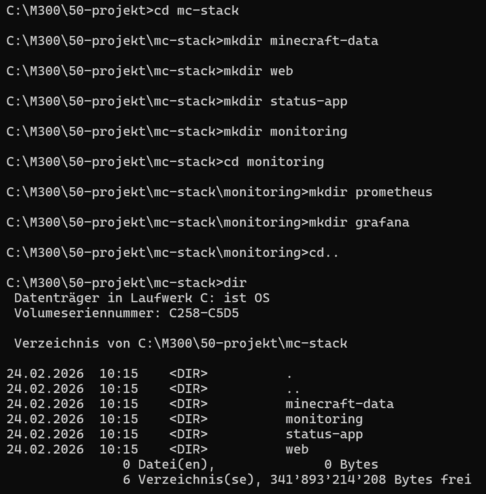

- Dcokerfile im Ordner mcstack erstellen

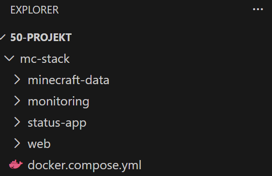

- Mit folgendem Befühlen

```bash
services:
  minecraft:
    image: itzg/minecraft-server:latest
    container_name: minecraft
    environment:
      EULA: "TRUE"
      TYPE: "PAPER"         
      VERSION: "1.21.10"     
      MEMORY: "2G"
      MOTD: "ServerPlus (Docker)"
      ENABLE_RCON: "true"
      RCON_PASSWORD: "changeme_rcon"
    ports:
      - "25565:25565"        
      - "25575:25575"        
    volumes:
      - ./minecraft-data:/data
    restart: unless-stopped
    networks:
      - backend
  status-app:
    build: ./status-app
    container_name: status-app
    environment:
      MC_HOST: "minecraft"
      MC_PORT: "25565"
    depends_on:
      - minecraft
    ports:
      - "8080:8080"
    restart: unless-stopped
    networks:
      - backend
  web:
    image: nginx:alpine
    container_name: web
    depends_on:
      - status-app
      - grafana
    ports:
      - "80:80"
    volumes:
      - ./web/nginx.conf:/etc/nginx/conf.d/default.conf:ro
      - ./web/site:/usr/share/nginx/html:ro
    restart: unless-stopped
    networks:
      - backend
  prometheus:
    image: prom/prometheus:latest
    container_name: prometheus
    volumes:
      - ./monitoring/prometheus/prometheus.yml:/etc/prometheus/prometheus.yml:ro
    ports:
      - "9090:9090"
    restart: unless-stopped
    networks:
      - backend
  cadvisor:
    image: gcr.io/cadvisor/cadvisor:latest
    container_name: cadvisor
    privileged: true
    volumes:
      - /:/rootfs:ro
      - /var/run:/var/run:rw
      - /sys:/sys:ro
      - /var/lib/docker/:/var/lib/docker:ro
    ports:
      - "8081:8080"
    restart: unless-stopped
    networks:
      - backend
  grafana:
    image: grafana/grafana:latest
    container_name: grafana
    ports:
      - "3000:3000"
    volumes:
      - ./monitoring/grafana:/var/lib/grafana
    restart: unless-stopped
    networks:
      - backend

networks:
  backend:
    driver: bridge
```

- Dockerfile im Ordner status-app erstellen

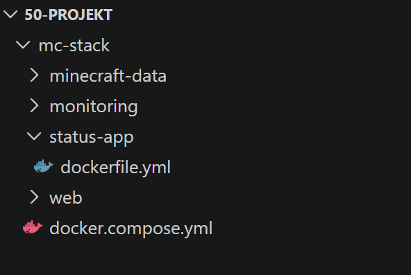

- Folgenden Code einsetzten

```bash
FROM python:3.12-slim

WORKDIR /app
RUN pip install --no-cache-dir flask mcstatus

COPY app.py /app/app.py
EXPOSE 8080

CMD ["python", "app.py"]
```

- Im Ordner status-app das app-python file erstellen

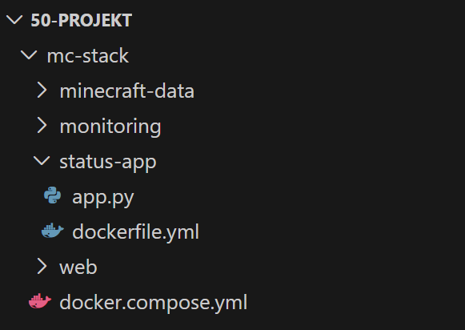

- Mit folgendem Inhalt

```bash
import os
from flask import Flask, jsonify
from mcstatus import JavaServer

app = Flask(__name__)

MC_HOST = os.getenv("MC_HOST", "minecraft")
MC_PORT = int(os.getenv("MC_PORT", "25565"))

@app.get("/api/status")
def status():
    try:
        server = JavaServer.lookup(f"{MC_HOST}:{MC_PORT}")
        status = server.status()
        return jsonify({
            "online": True,
            "latency_ms": status.latency,
            "players_online": status.players.online,
            "players_max": status.players.max,
            "version": status.version.name,
            "motd": getattr(status.description, "to_plain", lambda: str(status.description))()
        })
    except Exception as e:
        return jsonify({"online": False, "error": str(e)}), 503

@app.get("/")
def home():
     return """
    <h2>Minecraft Server Status</h2>
    <p>Endpoint: <code>/api/status</code></p>
    <p>Tip: Open <code>/api/status</code> in browser.</p>
    """

if __name__ == "__main__":
    app.run(host="0.0.0.0", port=8080)
```

- Im Ordner web, das nginx.config file erstellen

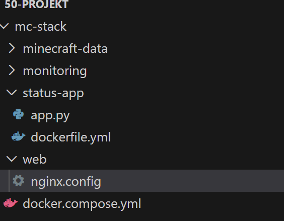

- Mit folgendem Inhalt

```bash
server {
  listen 80;

  location / {
    root /usr/share/nginx/html;
    index index.html;
  }

  location /status/ {
    proxy_pass http://status-app:8080/;
  }

  location /grafana/ {
    proxy_pass http://grafana:3000/;
  }
}
```

- Im Ordner Web/Site das Index.html file erstellen

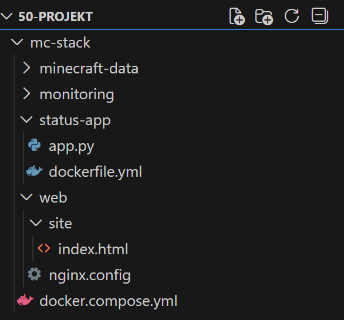

- Mit folgendem Inhalt

```bash
<!doctype html>
<html>
<head>
  <meta charset="utf-8"/>
  <title>ServerPlus Dashboard</title>
</head>
<body>
  <h1>ServerPlus Dashboard</h1>

  <ul>
    <li><a href="/status/api/status" target="_blank">Minecraft Status (API)</a></li>
    <li><a href="/grafana/" target="_blank">Grafana</a></li>
    <li><a href="http://localhost:9090" target="_blank">Prometheus</a></li>
    <li><a href="http://localhost:8081" target="_blank">cAdvisor</a></li>
  </ul>

  <h3>Quick Check</h3>
  <pre id="out">Loading...</pre>

  <script>
    fetch("/status/api/status")
      .then(r => r.json())
      .then(d => { document.getElementById("out").textContent = JSON.stringify(d, null, 2); })
      .catch(e => { document.getElementById("out").textContent = "Error: " + e; });
  </script>
</body>
</html>
```

- Unter Monitoring/Prometheus das prometheus.yml erstellen


- Mit folgendem Inhalt

```bash
global:
  scrape_interval: 5s

scrape_configs:
  - job_name: "cadvisor"
    static_configs:
      - targets: ["cadvisor:8080"]

  - job_name: "prometheus"
    static_configs:
      - targets: ["prometheus:9090"]
```

---

## Docker erstellen
- Im Ordner mc-stack den Befehl zum starten der Docker ausführen

```bash
docker compose up -d --build
```

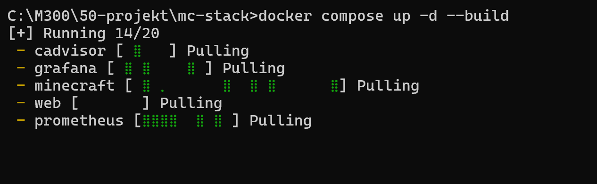

- Alle Container sollten laufen


## Dashboards und Monitoring

### Auf der Startseite kann man folgend Informationen sehen
- Spieler Online/Max
- Latenz/Ping
- Version
- Quick Check
- Links zu dem Grafana Dashboards, Prometheus um Queris zu ertsellen oder cAadvisior um die Container zum Monitoren

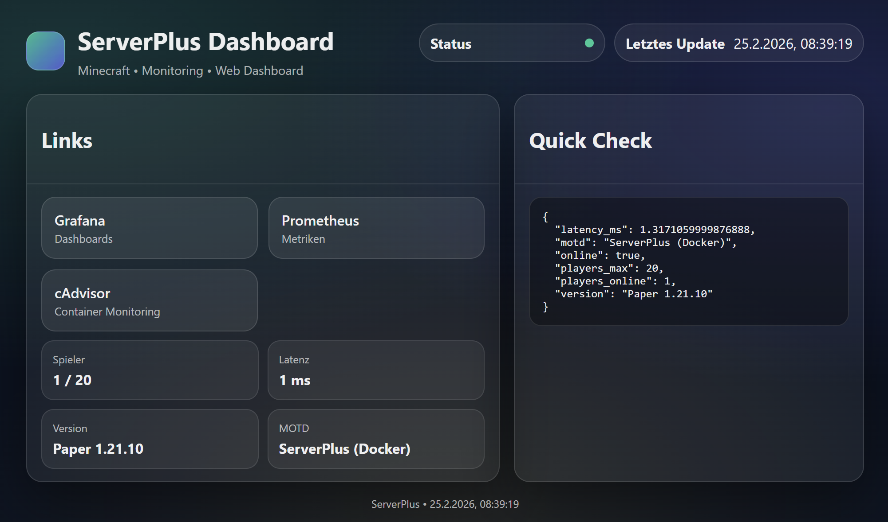


### Grafana Dashboards
- Auf der Grafana Seite kann man Dashboards zur Minecrfat-Welt erstellen, wie z.B Player-Online in jeder Dimension oder Anzahl Spieler die auf dem Server spielen

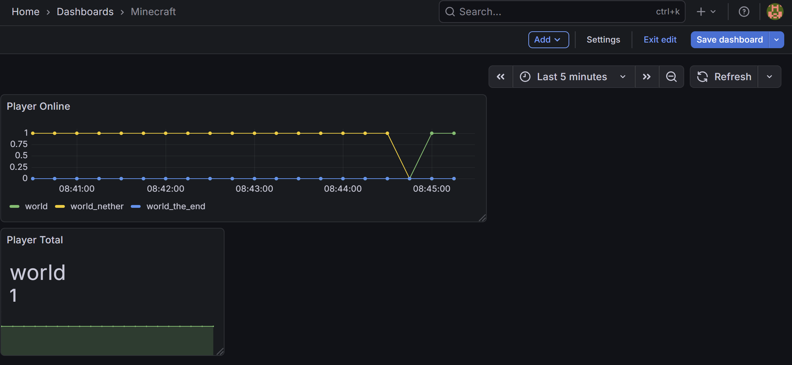

#### Neus Item erstellen
- Neue  Visualization hinzufügen
- Unter Metric das Item auswählen, z.B mc_player_online_total
- Auf der rechten Seite kann man diverse anpassungen am Graphen machen

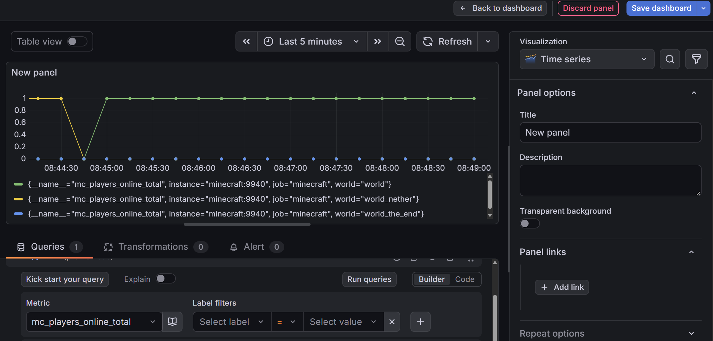

### cAdvisor
- Auf cAdvisor sieht man Monitoring von den Container aus Docker


- Verlauf von CPU-Usages
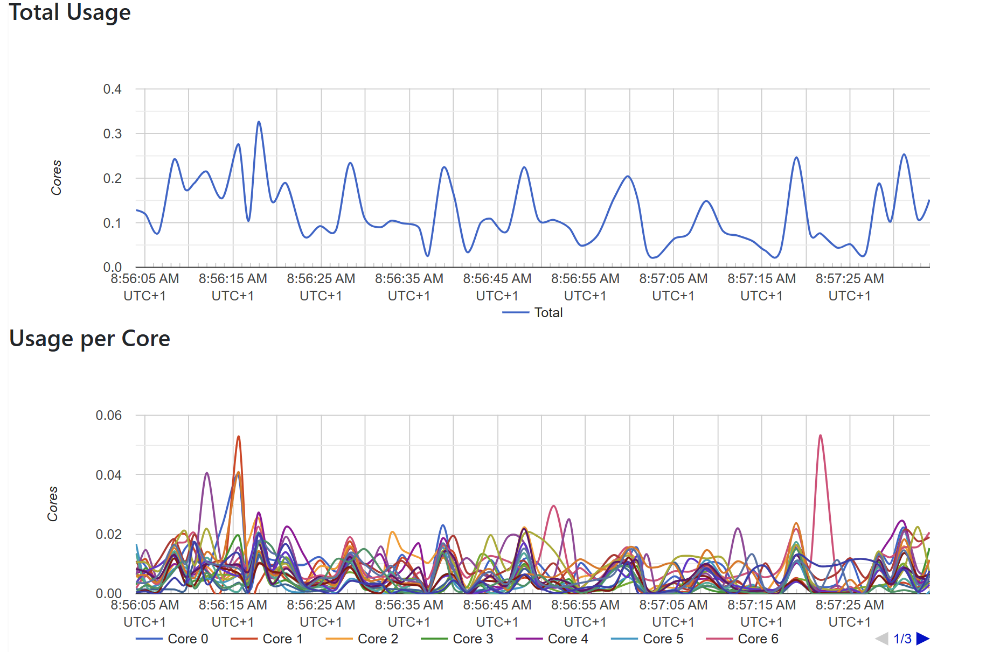


### Prometheus
- Auf der Seite von Prometheus kann man einzelne Abfragen (Querys) machen

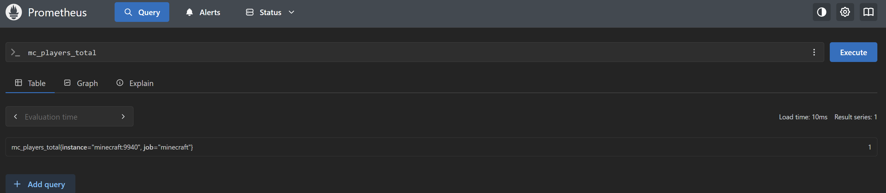

- Es dient ausserdem als Verbindung zwischen den Containern und cAdvisor oder Grafana
- Prometheus hat diese als Targets hinterlegt und liefert Daten

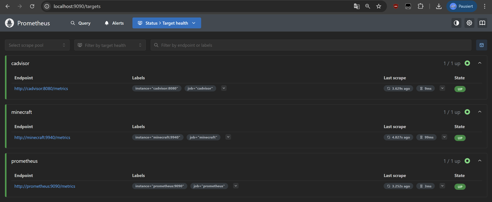

## Fehleranalyse und Verbesserung

### Überprüfung der Container nach docker compose up

- Container status prüfen mit 

```bash
docker ps
```

- Kontrolliert habe ich, dass alle Container auf dem richtigen Port laufen

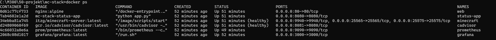

### Integration vom Minecraft-Ingame Metriken
- Nach dem ersten Starten der Container konnte ich nur Metriken der Container und nicht von dem Minecraft-Server, d.H Ich konnte keine player-Online, player-stats etc auslesen. 

- Dafür musste ich unter den Minecraft-Plugins das prometheus-export plugin installieren, diese plugin exportiert ingame-daten in prometheus, siehe scirpt

```bash
host: 0.0.0.0
port: 9940

enable_metrics:
  entities_total: true
  villagers_total: true
  loaded_chunks_total: true
  jvm_memory: true
  players_online_total: true
  players_total: true
  whitelisted_players: true
  tps: true
  world_size: true
  jvm_threads: true
  jvm_gc: true
  tick_duration_median: true
  tick_duration_average: true
  tick_duration_min: true
  tick_duration_max: true
  player_online: true
  player_statistic: true
  player_health: true
  player_hunger: true
  player_experience: true
  player_location: true
  player_ping: true
  player_gamemode: true
  player_world: true
  player_dimension: true
  player_status_effects: true
  player_inventory: true
  player_armor: true
  player_held_item: true
  player_scoreboard: true
  player_advancements: true
  player_achievements: true
  player_ender_chest: true
  player_potion_effects: true
  player_statistics: true
  player_vehicles: true
  player_experience_levels: true
  player_food_level: true
  player_saturation: true
  player_exhaustion: true
  player_air: true
  player_fire_ticks: true
  player_fall_distance: true
  player_total_experience: true
  player_total_experience_levels: true
  player_total_experience_progress: true
  player_total_experience_progress_percentage: true
  ```

- Server neustarten, Minecraft wird jetzt in Promethues unter den Targets angezeigt und es werdne die oben beschrieben Daten ausgelesen


### Port 9940 freigeben
- Der port war nicht erreichbar, weil er im docker-compose.yml nicht konfiguriert wird. Somit konnten keine Daten an Prometheus gesendet werden. 

```bash
services:
  minecraft:
    image: itzg/minecraft-server:latest
    container_name: minecraft
    environment:
      EULA: "TRUE"
      TYPE: "PAPER"
      VERSION: "1.21.10"
      MEMORY: "2G"
      MOTD: "ServerPlus (Docker)"
      ENABLE_RCON: "true"
      RCON_PASSWORD: "changeme_rcon"
    ports:
      - "25565:25565"
      - "25575:25575"
      - "9940:9940"
    volumes:
      - ./minecraft-data:/data
    restart: unless-stopped
    networks:
      - backend

  status-app:
    build: ./status-app
    container_name: status-app
    environment:
      MC_HOST: "minecraft"
      MC_PORT: "25565"
    depends_on:
      - minecraft
    ports:
      - "8080:8080"
    restart: unless-stopped
    networks:
      - backend

  web:
    image: nginx:alpine
    container_name: web
    depends_on:
      - status-app
      - grafana
    ports:
      - "80:80"
    volumes:
      - ./web/nginx.conf:/etc/nginx/conf.d/default.conf:ro
      - ./web/site:/usr/share/nginx/html:ro
    restart: unless-stopped
    networks:
      - backend

  prometheus:
    image: prom/prometheus:latest
    container_name: prometheus
    volumes:
      - ./monitoring/prometheus/prometheus.yml:/etc/prometheus/prometheus.yml:ro
    ports:
      - "9090:9090"
    restart: unless-stopped
    networks:
      - backend

  cadvisor:
    image: gcr.io/cadvisor/cadvisor:latest
    container_name: cadvisor
    privileged: true
    volumes:
      - /:/rootfs:ro
      - /var/run:/var/run:rw
      - /sys:/sys:ro
      - /var/lib/docker/:/var/lib/docker:ro
    ports:
      - "8081:8080"
    restart: unless-stopped
    networks:
      - backend

  grafana:
    image: grafana/grafana:latest
    container_name: grafana
    ports:
      - "3000:3000"
    volumes:
      - ./monitoring/grafana:/var/lib/grafana
    restart: unless-stopped
    networks:
      - backend

networks:
  backend:
    driver: bridge
```

- Unter Minecraft:Services:Ports wurden der Port 9940 hinzugefügt


### Website-Design anpassen
- Ich habe das Design der Startseite angepasst, dazu musste ich folgenden Inhalt in das index.html einfügen

```bash
<!doctype html>
<html lang="de">

<head>
    <meta charset="utf-8" />
    <meta name="viewport" content="width=device-width, initial-scale=1" />
    <title>ServerPlus Dashboard</title>
    <style>
        :root {
            --bg: #0b1220;
            --panel: rgba(255, 255, 255, 0.06);
            --panel2: rgba(255, 255, 255, 0.08);
            --text: rgba(255, 255, 255, 0.92);
            --muted: rgba(255, 255, 255, 0.65);
            --border: rgba(255, 255, 255, 0.12);
            --ok: #20c997;
            --bad: #ff6b6b;
            --warn: #ffd43b;
            --shadow: 0 20px 60px rgba(0, 0, 0, 0.45);
            --radius: 18px;
            --mono: ui-monospace, SFMono-Regular, Menlo, Monaco, Consolas, "Liberation Mono", "Courier New", monospace;
            --sans: ui-sans-serif, system-ui, -apple-system, Segoe UI, Roboto, Helvetica, Arial;
        }

        * {
            box-sizing: border-box
        }

        body {
            margin: 0;
            font-family: var(--sans);
            color: var(--text);
            background:
                radial-gradient(1200px 600px at 20% 10%, rgba(32, 201, 151, 0.18), transparent 60%),
                radial-gradient(1000px 520px at 80% 20%, rgba(99, 102, 241, 0.20), transparent 60%),
                radial-gradient(900px 520px at 50% 90%, rgba(255, 212, 59, 0.10), transparent 60%),
                var(--bg);
        }

        .wrap {
            max-width: 980px;
            margin: 0 auto;
            padding: 32px 18px 56px;
        }

        header {
            display: flex;
            align-items: flex-start;
            justify-content: space-between;
            gap: 16px;
            margin-bottom: 18px;
        }

        .brand {
            display: flex;
            gap: 14px;
            align-items: center;
        }

        .logo {
            width: 44px;
            height: 44px;
            border-radius: 14px;
            background: linear-gradient(135deg, rgba(32, 201, 151, 0.9), rgba(99, 102, 241, 0.85));
            border: 1px solid rgba(255, 255, 255, 0.16);
        }

        h1 {
            margin: 0;
            font-size: 28px
        }

        .sub {
            margin: 6px 0 0;
            color: var(--muted);
            font-size: 14px
        }

        .pillbar {
            display: flex;
            gap: 10px;
            flex-wrap: wrap;
        }

        .pill {
            padding: 10px 12px;
            border-radius: 999px;
            background: var(--panel);
            border: 1px solid var(--border);
            display: flex;
            gap: 10px;
            align-items: center;
            min-width: 210px;
            justify-content: space-between;
        }

        .dot {
            width: 10px;
            height: 10px;
            border-radius: 50%;
            background: var(--warn);
        }

        .dot.ok {
            background: var(--ok);
        }

        .dot.bad {
            background: var(--bad);
        }

        .grid {
            display: grid;
            grid-template-columns: 1.15fr 0.85fr;
            gap: 16px;
            margin-top: 14px;
        }

        .card {
            background: var(--panel);
            border: 1px solid var(--border);
            border-radius: var(--radius);
            box-shadow: var(--shadow);
            overflow: hidden;
        }

        .card .hd {
            padding: 14px 16px;
            border-bottom: 1px solid rgba(255, 255, 255, 0.1);
            display: flex;
            justify-content: space-between;
        }

        .card .bd {
            padding: 14px 16px
        }

        .links {
            display: grid;
            grid-template-columns: 1fr 1fr;
            gap: 12px;
        }

        a.tile {
            text-decoration: none;
            color: var(--text);
            background: var(--panel2);
            border: 1px solid rgba(255, 255, 255, 0.12);
            border-radius: 16px;
            padding: 14px;
            display: flex;
            align-items: center;
            justify-content: space-between;
        }

        .tile .name {
            font-weight: 600
        }

        .tile .desc {
            color: var(--muted);
            font-size: 12.5px;
            margin-top: 2px
        }

        pre {
            margin: 0;
            padding: 14px;
            border-radius: 14px;
            background: rgba(0, 0, 0, 0.35);
            border: 1px solid rgba(255, 255, 255, 0.1);
            font-family: var(--mono);
            font-size: 12.5px;
            overflow: auto;
            max-height: 340px;
        }

        button {
            border: 1px solid rgba(255, 255, 255, 0.14);
            background: rgba(255, 255, 255, 0.08);
            color: var(--text);
            padding: 10px 12px;
            border-radius: 12px;
            cursor: pointer;
            font-weight: 600;
        }

        .kvs {
            display: grid;
            grid-template-columns: 1fr 1fr;
            gap: 10px;
            margin-top: 10px;
        }

        .kv {
            padding: 12px;
            border-radius: 14px;
            border: 1px solid rgba(255, 255, 255, 0.1);
            background: rgba(255, 255, 255, 0.06);
        }

        .k {
            color: var(--muted);
            font-size: 12px
        }

        .v {
            margin-top: 4px;
            font-weight: 700
        }

        footer {
            margin-top: 16px;
            color: var(--muted);
            font-size: 12px;
            text-align: center;
        }
    </style>
</head>

<body>
    <div class="wrap">

        <header>
            <div class="brand">
                <div class="logo"></div>
                <div>
                    <h1>ServerPlus Dashboard</h1>
                    <p class="sub">Minecraft • Monitoring • Web Dashboard</p>
                </div>
            </div>

            <div class="pillbar">
                <div class="pill">
                    <span><b>Status</b></span>
                    <span class="dot" id="statusDot"></span>
                </div>
                <div class="pill">
                    <span><b>Letztes Update</b></span>
                    <span id="lastUpdate">—</span>
                </div>
            </div>
        </header>

        <div class="grid">

            <section class="card">
                <div class="hd">
                    <h2>Links</h2>
                </div>
                <div class="bd">
                    <div class="links">
                        <a class="tile" href="http://localhost:3000" target="_blank">
                            <div>
                                <div class="name">Grafana</div>
                                <div class="desc">Dashboards</div>
                            </div>
                        </a>

                        <a class="tile" href="http://localhost:9090" target="_blank">
                            <div>
                                <div class="name">Prometheus</div>
                                <div class="desc">Metriken</div>
                            </div>
                        </a>

                        <a class="tile" href="http://localhost:8081" target="_blank">
                            <div>
                                <div class="name">cAdvisor</div>
                                <div class="desc">Container Monitoring</div>
                            </div>
                        </a>
                    </div>

                    <div class="kvs">
                        <div class="kv">
                            <div class="k">Spieler</div>
                            <div class="v" id="players">—</div>
                        </div>
                        <div class="kv">
                            <div class="k">Latenz</div>
                            <div class="v" id="latency">—</div>
                        </div>
                        <div class="kv">
                            <div class="k">Version</div>
                            <div class="v" id="version">—</div>
                        </div>
                        <div class="kv">
                            <div class="k">MOTD</div>
                            <div class="v" id="motd">—</div>
                        </div>
                    </div>
                </div>
            </section>

            <section class="card">
                <div class="hd">
                    <h2>Quick Check</h2>
                </div>
                <div class="bd">
                    <pre id="out">Loading…</pre>
                </div>
            </section>

        </div>

        <footer>
            ServerPlus • <span id="footTime">—</span>
        </footer>

    </div>

    <script>
        const out = document.getElementById("out");
        const dot = document.getElementById("statusDot");
        const lastUpdate = document.getElementById("lastUpdate");
        const footTime = document.getElementById("footTime");
        const players = document.getElementById("players");
        const latency = document.getElementById("latency");
        const version = document.getElementById("version");
        const motd = document.getElementById("motd");

        function setDot(state) {
            dot.classList.remove("ok", "bad");
            if (state === "ok") dot.classList.add("ok");
            else if (state === "bad") dot.classList.add("bad");
        }

        function fmtTime(d) {
            return d.toLocaleString(undefined, { hour12: false });
        }

        async function loadStatus() {
            try {
                const r = await fetch("/status/api/status", { cache: "no-store" });
                const d = await r.json();
                out.textContent = JSON.stringify(d, null, 2);
                const now = new Date();
                footTime.textContent = fmtTime(now);
                lastUpdate.textContent = fmtTime(now);

                if (d.online) {
                    setDot("ok");
                    players.textContent = `${d.players_online} / ${d.players_max}`;
                    latency.textContent = `${Math.round(d.latency_ms)} ms`;
                    version.textContent = d.version || "—";
                    motd.textContent = d.motd || "—";
                } else {
                    setDot("bad");
                    players.textContent = "—";
                    latency.textContent = "—";
                    version.textContent = "—";
                    motd.textContent = "offline";
                }
            } catch (e) {
                setDot("bad");
                out.textContent = "Error: " + e;
            }
        }

        loadStatus();
        setInterval(loadStatus, 15000);
    </script>
</body>

</html>
```

# The END
